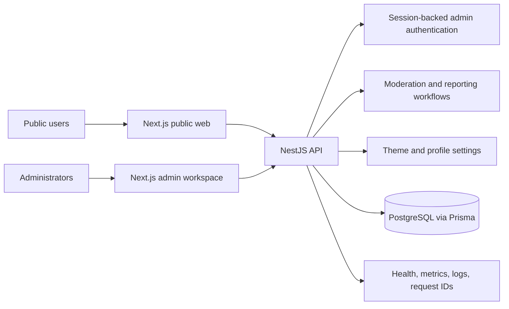
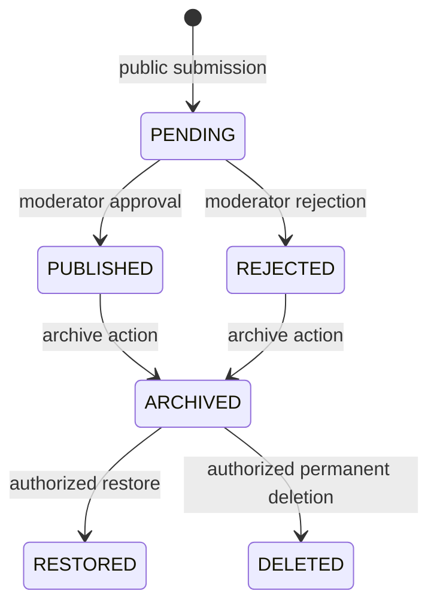
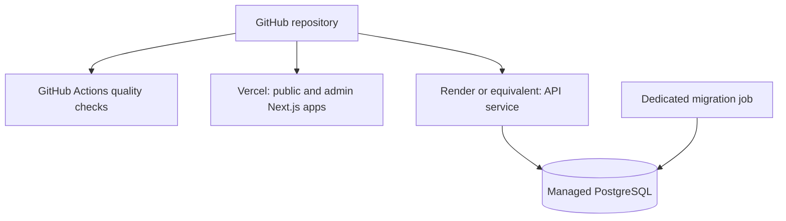

<div align="center">

# Social Media Service

**A moderation-first, anonymous publishing platform for campus communities.**

[](https://github.com/gulshanverse/social-media-service/actions/workflows/ci.yml)
[](https://nextjs.org/)
[](https://nestjs.com/)
[](https://www.typescriptlang.org/)
[](https://www.postgresql.org/)
[](https://www.prisma.io/)

</div>

---

## Overview

Social Media Service provides an anonymous submission flow, a reviewed public feed, themed content cards, and a protected operations workspace. Public content is not available immediately after submission: each record enters a moderation lifecycle and only approved records are projected to public clients.

The repository is structured as a pnpm monorepo. It separates the public Next.js application, the administrative Next.js application, and the NestJS API while sharing domain types, visual primitives, configuration, and theme definitions. PostgreSQL persistence is managed through Prisma migrations.

## Product capabilities

| Area | Implemented capabilities |
| --- | --- |
| Public experience | Anonymous submission, paginated feed, public record detail, category metadata, themed cards, responsive layouts, reporting, and share-oriented pages |
| Profile surface | Configurable handle, header and composer copy, community links, profile image, theme preset, prompt collection, and mobile preview |
| Moderation | Pending queue, server-side search and filters, sorting, pagination, approve/reject/archive actions, pending-record editing, bulk actions, and stale-state protection |
| Administration | Dashboard metrics, report review and resolution, append-only audit activity, theme CRUD, live public-card preview, profile settings, session visibility, and logout-all |
| Platform operations | Health, liveness, readiness, version, and metrics endpoints; request IDs; structured safe logging; normalized errors; graceful shutdown; and container health checks |
| Delivery | Docker API image, local PostgreSQL Compose service, Prisma migration workflow, GitHub Actions quality pipeline, and separate Next.js deployment targets |

## Technology stack

| Layer | Technology |
| --- | --- |
| Public web | Next.js 15, React 19, TypeScript |
| Admin web | Next.js 15, React 19, TypeScript |
| API | NestJS 10, Express, TypeScript |
| Persistence | PostgreSQL 16, Prisma 6 |
| Shared packages | TypeScript domain types, configuration, theme definitions, and React UI primitives |
| Validation | `class-validator`, `class-transformer`, strict whitelist validation |
| Authentication | HMAC access tokens, database-backed sessions, rotating HttpOnly refresh cookies |
| Observability | Request correlation IDs, structured logs, operational endpoints, Vercel Analytics, and Vercel Speed Insights |
| Tooling | pnpm 9.15.4, ESLint, Prettier, TypeScript, Vitest, Docker, GitHub Actions |

## Architecture



The architecture follows four boundaries:

1. **Public and administrative clients are separate applications.** The API remains the shared authority for validation, authorization, state transitions, and persistence.
2. **Public projections are deliberately narrow.** Public reads expose approved content only and exclude editor data, reports, audit records, administrator data, and credential material.
3. **Role checks are enforced server-side.** Frontend navigation improves usability but is not a security boundary.
4. **Database-backed filters are used for operations.** Queue and report search, sorting, and pagination execute through API query parameters rather than downloading entire tables to the browser.

## Core workflows

### Submission lifecycle



Public clients receive only `PUBLISHED` records. Administrative actions are protected by authentication and role checks, and successful state changes generate audit activity where applicable.

### Content editing

The current edit contract is intentionally narrow. Moderators can edit `PENDING` records in place by changing content, category, or theme identity. The original submitted value remains immutable, the public identifier is retained, and the current editor is recorded. Published, rejected, and archived records are not editable through the edit endpoint.

### Reporting

Public users can submit a report against a public record. Reports begin in `OPEN` state and may transition to `RESOLVED` or `DISMISSED` through the protected administrative workflow. Invalid repeat transitions are rejected and do not create a successful audit event.

## Theme and profile system

Themes are stored as data rather than hard-coded into a single card implementation. Theme records define background, gradient, typography, text and accent colors, border treatment, radius, logo and handle visibility, and layout variant. The public renderer and administrative preview consume the same theme properties.

The protected profile editor controls the public handle, header message, composer prompt, community CTA, bottom CTA, image, theme preset, prompts, character limit, card text size, and preview line count. The admin interface provides a responsive mobile preview before changes are saved.

## Administrative roles

| Role | Access boundary |
| --- | --- |
| `SUPER_ADMIN` | Full intended administrative access, including moderation, reports, themes, audit activity, and session operations |
| `MODERATOR` | Moderation and report workflows; theme read access; no audit access or theme mutation |
| `DESIGNER` | Theme read and mutation access; no moderation, report processing, or audit access |

The API loads the current administrator from the database on protected requests. Active status and the database role remain authoritative even when the client hides unavailable navigation items.

## Security controls

Implemented controls include:

- Short-lived HMAC access tokens with explicit token types and separate refresh-token signing material.
- Refresh credentials stored only as hashes in `AdminSession` records and delivered through rotating HttpOnly cookies.
- Atomic refresh rotation that rejects reuse of an earlier credential.
- Revocation, expiration, ownership, and inactive-account checks for administrator sessions.
- Bcrypt password hashing for seeded administrator accounts.
- Role-based authorization through API guards.
- Strict DTO validation with unknown-field rejection and explicit response projections.
- Explicit credentialed CORS origins, Helmet headers, and production-only secure cookies.
- Process-local IP-aware throttles for login, refresh, and anonymous submission flows.
- Safe production errors that omit stack traces, SQL, paths, tokens, cookies, authorization headers, and database URLs.
- Append-only audit records through the application API.
- Non-root API container execution and a liveness health check.

The current throttling implementation is process-local. A multi-instance deployment requires a shared gateway or distributed limiter before horizontal scaling.

## Repository structure

```text
.
├── apps/
│   ├── web/                 # Public Next.js application
│   ├── admin/               # Protected Next.js operations workspace
│   └── api/                 # NestJS API and business logic
├── packages/
│   ├── config/              # Shared runtime configuration
│   ├── themes/              # Shared theme definitions
│   ├── types/               # Shared domain types and enums
│   └── ui/                  # Shared React UI primitives
├── prisma/
│   ├── migrations/          # Versioned PostgreSQL migrations
│   ├── schema.prisma        # Prisma data model
│   └── seed.ts               # Development administrator and theme seed
├── docs/                    # Architecture, API, deployment, operations, and security docs
├── .github/workflows/       # GitHub Actions quality workflow
├── Dockerfile               # Multi-stage non-root API image
├── docker-compose.yml       # Local PostgreSQL service
├── package.json             # Root scripts and Prisma commands
└── pnpm-workspace.yaml      # Workspace definition
```

## Local development

### Prerequisites

- Node.js 22
- pnpm 9.15.4
- PostgreSQL 16, or Docker with Docker Compose
- Git

### Setup

```bash
git clone https://github.com/gulshanverse/social-media-service.git
cd social-media-service
pnpm install
cp .env.example .env
```

Set the local values in `.env`. The template contains the complete variable set used by the applications. For a local database, either run PostgreSQL directly or start the repository-provided service:

```bash
docker compose up -d postgres
pnpm db:generate
pnpm db:push
pnpm db:seed
pnpm dev
```

`pnpm db:push` is intended for local development. Staging and production use the versioned migration command `pnpm db:migrate:deploy` from a dedicated release or migration job; do not replace migrations with schema pushes in a deployed environment.

The development servers use these ports:

| Application | Command | Port |
| --- | --- | ---: |
| Public web | `pnpm --filter @ggv/web dev` | 3000 |
| Admin workspace | `pnpm --filter @ggv/admin dev` | 3001 |
| API | `pnpm --filter @ggv/api dev` | 4000 |
| All applications | `pnpm dev` | 3000, 3001, 4000 |

## Environment variables

The following variables are defined by `.env.example` and are grouped by purpose.

| Variable group | Variables | Purpose |
| --- | --- | --- |
| Database and runtime | `DATABASE_URL`, `NODE_ENV`, `PORT` | PostgreSQL connection and API runtime |
| Proxy and authentication | `TRUST_PROXY_HOPS`, `JWT_SECRET`, `JWT_REFRESH_SECRET` | Client IP resolution and token signing |
| Administrator bootstrap | `ADMIN_SEED_EMAIL`, `ADMIN_SEED_PASSWORD` | Development-only initial administrator seed |
| Rate limits | `ADMIN_LOGIN_RATE_LIMIT`, `ADMIN_LOGIN_RATE_WINDOW_SECONDS`, `ADMIN_REFRESH_RATE_LIMIT`, `ADMIN_REFRESH_RATE_WINDOW_SECONDS`, `SUBMISSION_RATE_LIMIT`, `SUBMISSION_RATE_WINDOW_SECONDS` | Process-local request throttling |
| Browser origins | `NEXT_PUBLIC_API_URL`, `WEB_ORIGIN`, `ADMIN_ORIGIN` | API location and exact credentialed CORS origins |
| Build metadata | `APP_VERSION`, `GIT_COMMIT` | Safe version and deployment metadata responses |

Do not commit real credentials or production connection strings. Production authentication secrets are required; the API fails closed when they are missing.

## API surface

The API is served by NestJS on port `4000`. The main API areas are:

| Area | Responsibility |
| --- | --- |
| Public submission and feed resources | Create pending records, list approved records, return public detail, expose profile settings, and accept reports |
| `/admin/auth/*` | Login, refresh, logout, current administrator, session listing, and logout-all |
| `/admin/dashboard` | Aggregate operational counts |
| `/admin/*` moderation resources | Queue search, filters, pagination, detail, edit, lifecycle actions, and bulk actions |
| `/admin/reports/*` | Report listing, detail, resolve, and dismiss |
| `/admin/audit` | Super-administrator audit activity |
| `/admin/themes` | Theme listing, creation, updates, and preview data |
| `/admin/profile-settings` | Protected profile configuration and image management |
| `/health*` | Health, liveness, readiness, version, and metrics responses |

All administrative list responses use a paginated contract where applicable: `{ items, page, limit, total, hasMore }`. Responses include a request identifier, and normalized errors use `{ statusCode, message, code, requestId }` where available.

## Observability

| Endpoint | Purpose |
| --- | --- |
| `GET /health` | Basic application health |
| `GET /health/live` | Liveness signal for restart checks |
| `GET /health/ready` | PostgreSQL-backed readiness signal for traffic routing |
| `GET /health/version` | Safe build and deployment metadata |
| `GET /health/metrics` | Lightweight operational counters |

The API generates or validates `X-Request-ID` values, emits structured safe logs, normalizes production errors, and closes the Nest application and Prisma client during graceful shutdown.

## Deployment

The repository separates deployment targets:



The deployment documentation defines the production path: install with the frozen lockfile, generate Prisma Client, validate the schema, run quality checks, build the API image, apply migrations from the exact release commit, then start the service and verify liveness, readiness, version metadata, and request IDs. Configure exact browser origins and operational build metadata in the target environment.

## Docker

The root `Dockerfile` builds the API in multiple stages, prunes development dependencies, runs as a non-root `app` user, exposes port `4000`, and defines a liveness health check. The runtime image receives configuration through environment variables and does not bake `.env` files into the image.

For local PostgreSQL only:

```bash
docker compose up -d postgres
docker compose down
```

## Quality checks

The GitHub Actions workflow runs on pushes to `main` and pull requests. It uses Node.js 22, pnpm 9.15.4, and the following checks:

```bash
pnpm install --frozen-lockfile
pnpm db:generate
pnpm prisma validate
pnpm format:check
pnpm lint
pnpm typecheck
pnpm test
pnpm build
```

The test suite covers the API domain modules and HTTP behavior, administrative authorization, rate limiting, proxy handling, and other production-readiness constraints. The web package currently reports that it has no runtime tests; the admin package runs Vitest.

## Screenshots

No screenshots are currently stored in the repository. This README intentionally does not reference fabricated image paths. Add captures from the deployed public interface and administrative workspace under a tracked assets directory when they are available.

## Documentation

- [Architecture](docs/architecture.md)
- [API contracts](docs/api.md)
- [Moderation rules](docs/moderation.md)
- [Deployment](docs/deployment.md)
- [Security](docs/security.md)
- [Operations](docs/operations.md)
- [Production runbook](docs/production-runbook.md)
- [Design system](docs/design-system.md)

## Contributing

1. Fork or clone the repository.
2. Create a focused branch from `main`.
3. Install dependencies with `pnpm install`.
4. Make the smallest change that addresses the requirement.
5. Run formatting, linting, type checking, tests, and the build.
6. Commit with a focused message.
7. Open a pull request with the behavior change and validation results.

Application code, database migrations, and deployment changes should remain consistent with the contracts documented in `docs/`.

## Project status

| Component | Status |
| --- | --- |
| Public web application | Implemented Next.js application |
| Administrative workspace | Implemented role-aware Next.js application |
| API | Implemented NestJS service with Prisma persistence |
| Database | PostgreSQL schema with versioned migrations |
| CI | GitHub Actions quality workflow configured |
| Local infrastructure | Docker Compose PostgreSQL helper and production-oriented API Dockerfile |

## License

License information is not currently specified in this repository.

## Maintainer

The repository is maintained under the [gulshanverse GitHub account](https://github.com/gulshanverse).
