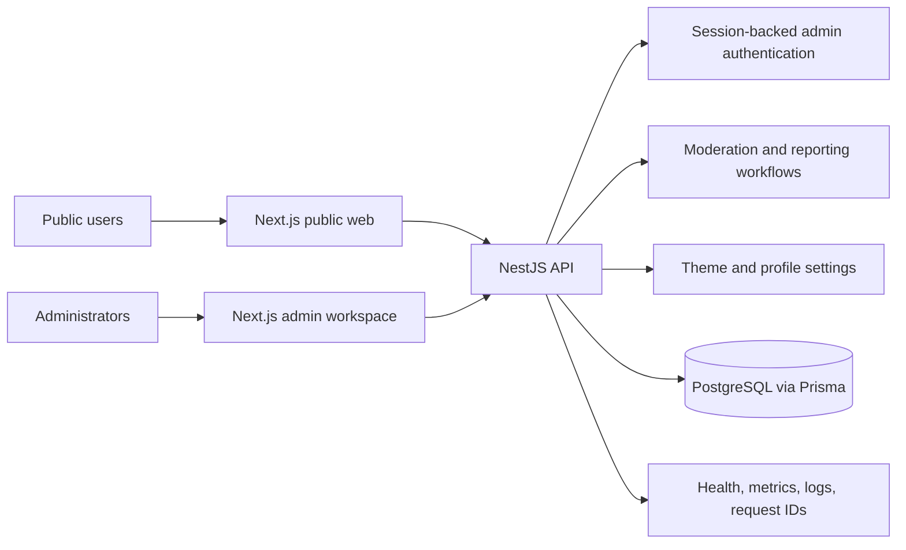
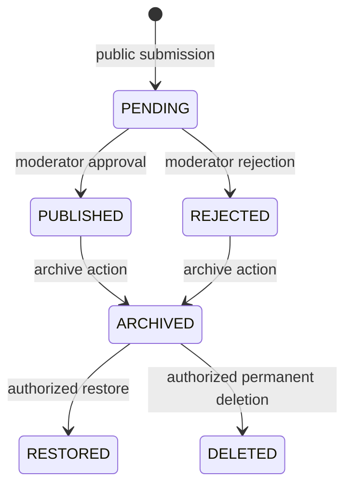
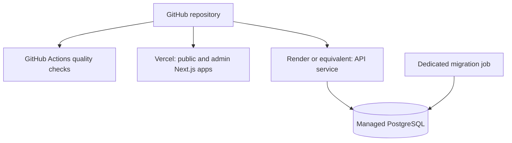

<div align="center">

# College Confession

**Anonymous campus stories, thoughts, conversations, and confessions.**

The `social-media-service` repository contains the production monorepo for College Confession: a moderation-first public web experience, administrative workspace, and NestJS API.

[](https://github.com/gulshanverse/social-media-service/actions/workflows/ci.yml)
[](https://github.com/gulshanverse/social-media-service/actions/workflows/codeql.yml)
[](https://github.com/gulshanverse/social-media-service/actions/workflows/dependency-review.yml)
[](https://nextjs.org/)
[](https://nestjs.com/)
[](https://www.typescriptlang.org/)
[](https://www.postgresql.org/)
[](https://www.prisma.io/)

</div>

---

## Product preview

The repository does not currently contain production screenshots. Do not substitute fabricated image URLs. Before the screenshot gallery is considered complete, capture and add the following real views from the deployed application:

1. Public landing page
2. College Confession composer
3. Public confession feed
4. Individual confession detail experience
5. Admin moderation workspace
6. Theme and live-preview workspace
7. Profile editor

## Overview

Social Media Service provides an anonymous submission flow, a reviewed public feed, themed content cards, and a protected operations workspace. Public content is not available immediately after submission: each record enters a moderation lifecycle and only approved records are projected to public clients.

The repository is structured as a pnpm monorepo. It separates the public Next.js application, the administrative Next.js application, and the NestJS API while sharing domain types, visual primitives, configuration, and theme definitions. PostgreSQL persistence is managed through Prisma migrations.

## Product capabilities

| Area | Implemented capabilities |
| --- | --- |
| Public experience | Anonymous submission, paginated feed, public record detail, category metadata, themed cards, responsive layouts, reporting, and share-oriented pages |
| Profile surface | Configurable handle, header and composer copy, community links, profile image, theme preset, prompt collection, and mobile preview |
| Moderation | Pending queue, server-side search and filters, sorting, pagination, approve/reject/archive actions, pending and published-record editing, bulk actions, and stale-state protection |
| Administration | Dashboard metrics, report review and resolution, append-only audit activity, theme CRUD, live public-card preview, profile settings, session visibility, and logout-all |
| Platform operations | Health, liveness, readiness, version, and metrics endpoints; request IDs; structured safe logging; normalized errors; graceful shutdown; and container health checks |
| Delivery | Docker API image, local PostgreSQL Compose service, Prisma migration workflow, GitHub Actions quality pipeline, and separate Next.js deployment targets |

## Technology stack

| Layer | Technology |
| --- | --- |
| Public web | Next.js 15, React 19, TypeScript |
| Admin web | Next.js 15, React 19, TypeScript |
| API | NestJS 10, Express, TypeScript |
| Persistence | PostgreSQL 16, Prisma 6 |
| Shared packages | TypeScript domain types, configuration, theme definitions, and React UI primitives |
| Validation | `class-validator`, `class-transformer`, strict whitelist validation |
| Authentication | HMAC access tokens, database-backed sessions, rotating HttpOnly refresh cookies |
| Observability | Request correlation IDs, structured logs, operational endpoints, Vercel Analytics, and Vercel Speed Insights |
| Tooling | pnpm 9.15.4, ESLint, Prettier, TypeScript, Vitest, Docker, GitHub Actions |

## Architecture



The architecture follows four boundaries:

1. **Public and administrative clients are separate applications.** The API remains the shared authority for validation, authorization, state transitions, and persistence.
2. **Public projections are deliberately narrow.** Public reads expose approved content only and exclude editor data, reports, audit records, administrator data, and credential material.
3. **Role checks are enforced server-side.** Frontend navigation improves usability but is not a security boundary.
4. **Database-backed filters are used for operations.** Queue and report search, sorting, and pagination execute through API query parameters rather than downloading entire tables to the browser.

## Core workflows

### Submission lifecycle



Public clients receive only `PUBLISHED` records. Administrative actions are protected by authentication and role checks, and successful state changes generate audit activity where applicable.

### Published editing

The edit contract operates on the existing database record. Moderators can edit both `PENDING` and `PUBLISHED` records by changing content, category, or theme identity. The public identifier remains unchanged, the status remains `PUBLISHED` for a published record, `originalContent` remains preserved, and associated reports remain attached to the same record. No duplicate record is created. A published edit emits the `PUBLISHED_CONFESSION_EDITED` audit action. `REJECTED` and `ARCHIVED` records remain non-editable.

### Reporting

Public users can submit a report against a public record. Reports begin in `OPEN` state and may transition to `RESOLVED` or `DISMISSED` through the protected administrative workflow. Invalid repeat transitions are rejected and do not create a successful audit event.

## Theme and profile system

Themes are stored as data rather than hard-coded into a single card implementation. Theme records define background, gradient, typography, text and accent colors, border treatment, radius, logo and handle visibility, and layout variant. The public renderer and administrative preview consume the same theme properties.

The protected profile editor controls the public handle, header message, composer prompt, community CTA, bottom CTA, image, theme preset, prompts, character limit, card text size, and preview line count. The admin interface provides a responsive mobile preview before changes are saved.

## Administrative roles

| Role | Access boundary |
| --- | --- |
| `SUPER_ADMIN` | Full intended administrative access, including moderation, reports, themes, audit activity, and session operations |
| `MODERATOR` | Moderation and report workflows; theme read access; no audit access or theme mutation |
| `DESIGNER` | Theme read and mutation access; no moderation, report processing, or audit access |

The API loads the current administrator from the database on protected requests. Active status and the database role remain authoritative even when the client hides unavailable navigation items.

## Security controls

Implemented controls include:

- Short-lived HMAC access tokens with explicit token types and separate refresh-token signing material.
- Refresh credentials stored only as hashes in `AdminSession` records and delivered through rotating HttpOnly cookies.
- Atomic refresh rotation that rejects reuse of an earlier credential.
- Revocation, expiration, ownership, and inactive-account checks for administrator sessions.
- Bcrypt password hashing for seeded administrator accounts.
- Role-based authorization through API guards.
- Strict DTO validation with unknown-field rejection and explicit response projections.
- Explicit credentialed CORS origins, Helmet headers, and production-only secure cookies.
- Process-local IP-aware throttles for login, refresh, and anonymous submission flows.
- Safe production errors that omit stack traces, SQL, paths, tokens, cookies, authorization headers, and database URLs.
- Append-only audit records through the application API.
- Non-root API container execution and a liveness health check.

The current throttling implementation is process-local. A multi-instance deployment requires a shared gateway or distributed limiter before horizontal scaling.

## Repository structure

```text
.
├── apps/
│   ├── web/                 # Public Next.js application
│   ├── admin/               # Protected Next.js operations workspace
│   └── api/                 # NestJS API and business logic
├── packages/
│   ├── config/              # Shared runtime configuration
│   ├── themes/              # Shared theme definitions
│   ├── types/               # Shared domain types and enums
│   └── ui/                  # Shared React UI primitives
├── prisma/
│   ├── migrations/          # Versioned PostgreSQL migrations
│   ├── schema.prisma        # Prisma data model
│   └── seed.ts               # Development administrator and theme seed
├── docs/                    # Architecture, API, deployment, operations, and security docs
├── .github/workflows/       # GitHub Actions quality workflow
├── Dockerfile               # Multi-stage non-root API image
├── docker-compose.yml       # Local PostgreSQL service
├── package.json             # Root scripts and Prisma commands
└── pnpm-workspace.yaml      # Workspace definition
```

## Local development

### Prerequisites

- Node.js 22
- pnpm 9.15.4
- PostgreSQL 16, or Docker with Docker Compose
- Git

### Setup

```bash
git clone https://github.com/gulshanverse/social-media-service.git
cd social-media-service
pnpm install
cp .env.example .env
```

Set the local values in `.env`. The template contains the complete variable set used by the applications. For a local database, either run PostgreSQL directly or start the repository-provided service:

```bash
docker compose up -d postgres
pnpm db:generate
pnpm db:push
pnpm db:seed
pnpm dev
```

`pnpm db:push` is intended for local development. Staging and production use the versioned migration command `pnpm db:migrate:deploy` from a dedicated release or migration job; do not replace migrations with schema pushes in a deployed environment.

The development servers use these ports:

| Application | Command | Port |
| --- | --- | ---: |
| Public web | `pnpm --filter @ggv/web dev` | 3000 |
| Admin workspace | `pnpm --filter @ggv/admin dev` | 3001 |
| API | `pnpm --filter @ggv/api dev` | 4000 |
| All applications | `pnpm dev` | 3000, 3001, 4000 |

## Environment variables

The following variables are defined by `.env.example` and are grouped by purpose.

| Variable group | Variables | Purpose |
| --- | --- | --- |
| Database and runtime | `DATABASE_URL`, `NODE_ENV`, `PORT` | PostgreSQL connection and API runtime |
| Proxy and authentication | `TRUST_PROXY_HOPS`, `JWT_SECRET`, `JWT_REFRESH_SECRET` | Client IP resolution and token signing |
| Administrator bootstrap | `ADMIN_SEED_EMAIL`, `ADMIN_SEED_PASSWORD` | Development-only initial administrator seed |
| Rate limits | `ADMIN_LOGIN_RATE_LIMIT`, `ADMIN_LOGIN_RATE_WINDOW_SECONDS`, `ADMIN_REFRESH_RATE_LIMIT`, `ADMIN_REFRESH_RATE_WINDOW_SECONDS`, `SUBMISSION_RATE_LIMIT`, `SUBMISSION_RATE_WINDOW_SECONDS` | Process-local request throttling |
| Browser origins | `NEXT_PUBLIC_API_URL`, `WEB_ORIGIN`, `ADMIN_ORIGIN` | API location and exact credentialed CORS origins |
| Build metadata | `APP_VERSION`, `GIT_COMMIT` | Safe version and deployment metadata responses |

Do not commit real credentials or production connection strings. Production authentication secrets are required; the API fails closed when they are missing.

## API reference

The NestJS API listens on port `4000` by default. Unless otherwise noted, request and response bodies use `application/json`. The API applies strict global validation: unknown body fields are rejected, query values are transformed and validated, and malformed input returns a `400` response. Values shown in response examples are illustrative and do not represent production data or metrics.

### Response conventions

Administrative list endpoints return the following envelope:

```json
{
  "items": [],
  "page": 1,
  "limit": 20,
  "total": 0,
  "hasMore": false
}
```

Every response receives an `X-Request-ID`. A bounded incoming identifier is reused; otherwise the API generates one. Normalized production errors use this shape where applicable:

```json
{
  "statusCode": 400,
  "message": "Invalid request.",
  "code": "BAD_REQUEST",
  "requestId": "generated-or-forwarded-id"
}
```

`429` responses may include `Retry-After`. Production error responses do not expose stack traces, SQL, filesystem paths, tokens, cookies, authorization headers, or database URLs.

### Public endpoints

Public endpoints do not require authentication. Public reads return only records with `PUBLISHED` status. Public projections contain no editor, report, audit, administrator, password, session, or internal persistence fields.

#### `POST /confessions`

Creates an anonymous submission with `PENDING` status. The request is rate limited by the client IP and uses the configured profile character limit.

Request body:

```json
{
  "content": "A campus message up to the configured character limit.",
  "category": "ADVICE",
  "themeId": "midnight"
}
```

`content` is required and trimmed. `category` is optional and must be one of `CRUSH`, `RELATIONSHIP`, `FRIENDSHIP`, `FUNNY`, `COLLEGE_LIFE`, `ADVICE`, `APPRECIATION`, `RANT`, or `OTHER`. `themeId` is optional; the default is `midnight` and it must identify a valid seeded theme.

Response `201`:

```json
{
  "publicId": "m2abc123-4f8a1b2c",
  "status": "PENDING",
  "message": "Your confession has been submitted for review."
}
```

Possible responses include `400` for invalid content, category, or theme and `429` when the submission rate limit is exceeded. The rate-limit response contains `message` and `retryAfterSeconds`.

#### `GET /confessions`

Returns the newest published records and public display settings. Query parameters are optional: `page` defaults to `1` and `limit` defaults to `12`, with bounds of `1..100` for pages and `1..50` for page size.

Response `200`:

```json
{
  "items": [
    {
      "publicId": "m2abc123-4f8a1b2c",
      "content": "A published message.",
      "category": "ADVICE",
      "theme": {
        "id": "midnight",
        "name": "Midnight",
        "background": "#10131f",
        "gradient": "linear-gradient(...) ",
        "textColor": "#ffffff",
        "accentColor": "#8b5cf6",
        "fontFamily": "Inter",
        "radius": "28px"
      },
      "publishedAt": "2026-09-24T04:00:00.000Z"
    }
  ],
  "display": { "cardTextSize": 16, "previewLines": 5 },
  "page": 1,
  "limit": 12,
  "total": 1,
  "hasMore": false
}
```

#### `GET /confessions/:publicId`

Returns one published record using its public identifier and increments its view counter. The response uses the same public item shape as the feed, without the `display` and pagination fields. A missing or non-published identifier returns `404`.

#### `GET /confessions/profile-settings`

Returns the public profile configuration used by the composer and profile page:

```json
{
  "handle": "@college.confession.ggv",
  "headerMessage": "send me anonymous weekly Confession!",
  "defaultPrompt": "Are u talking to anyone??",
  "communityButtonText": "Visit Community",
  "communityPath": "/confessions",
  "bottomButtonText": "Get your own messages!",
  "profileImageUrl": null,
  "themePreset": "sunset",
  "maxCharacters": 1000,
  "cardTextSize": 16,
  "previewLines": 5,
  "prompts": ["Are u talking to anyone??"]
}
```

#### `POST /confessions/:publicId/report`

Creates a moderation report for a published record. The request is associated with a SHA-256 hash of the client IP rather than storing the raw address.

Request body:

```json
{ "reason": "SPAM" }
```

Allowed reasons are `HARASSMENT`, `HATE`, `SEXUAL_CONTENT`, `THREAT`, `SPAM`, `PERSONAL_INFORMATION`, and `OTHER`.

Response `201`:

```json
{ "status": "RECEIVED", "message": "Thanks. The moderation team will review this report." }
```

An existing open report from the same client returns `200` with the same status and a message stating that the report is already with the moderation team.

### Administrator authentication

Administrative endpoints use a short-lived bearer access token in `Authorization: Bearer <accessToken>`. Login and refresh also manage the rotating `admin_refresh` HttpOnly cookie. Refresh credentials are never returned in JSON or stored raw in the database.

#### `POST /admin/auth/login`

Request body:

```json
{ "email": "admin@example.com", "password": "development-password" }
```

Response `200` sets the refresh cookie and returns:

```json
{
  "admin": { "id": "admin-id", "email": "admin@example.com", "name": "Admin", "role": "SUPER_ADMIN", "isActive": true },
  "accessToken": "short-lived-access-token"
}
```

Invalid credentials return `401`. Login throttling returns `429` and a `Retry-After` header.

#### `POST /admin/auth/refresh`

Send the `admin_refresh` cookie. The JSON body may be empty (`{}`). On success, the server atomically rotates the refresh credential and returns:

```json
{ "accessToken": "new-short-lived-access-token" }
```

Invalid, expired, revoked, reused, or missing credentials return `401` and clear the cookie. Refresh throttling returns `429`.

#### `POST /admin/auth/logout`

Requires a bearer access token. Revokes the current database session, clears the refresh cookie, records a `LOGOUT` audit event, and returns:

```json
{ "success": true }
```

#### `GET /admin/auth/me`

Requires a bearer token and returns the current safe administrator projection:

```json
{ "id": "admin-id", "email": "admin@example.com", "name": "Admin", "role": "MODERATOR", "isActive": true }
```

#### `GET /admin/auth/sessions`

Requires a bearer token and returns active session metadata for the current administrator. Tokens and hashes are excluded:

```json
{
  "items": [
    { "id": "session-id", "createdAt": "2026-09-24T04:00:00.000Z", "lastUsedAt": null, "expiresAt": "2026-10-01T04:00:00.000Z", "revokedAt": null, "current": true }
  ]
}
```

#### `POST /admin/auth/logout-all`

Requires a bearer token, revokes all active sessions for the current administrator, clears the current cookie, and returns:

```json
{ "success": true, "revoked": 2 }
```

### Administrative moderation

All routes in this section require a bearer token and role authorization. `SUPER_ADMIN` and `MODERATOR` can operate moderation and report workflows. `DESIGNER` cannot access them.

#### `GET /admin/dashboard`

Returns aggregate operational counts and the six most recent relevant activity events:

```json
{
  "pendingConfessions": 12,
  "publishedConfessions": 84,
  "rejectedConfessions": 4,
  "archivedConfessions": 3,
  "openReports": 2,
  "resolvedReports": 18,
  "totalConfessions": 103,
  "activeThemes": 5,
  "recentActivity": [
    { "id": "audit-id", "action": "APPROVE", "entity": "CONFESSION", "entityId": "record-id", "createdAt": "2026-09-24T04:00:00.000Z", "actor": { "email": "moderator@example.com" } }
  ]
}
```

#### `GET /admin/confessions`

Returns the administrative queue. Query parameters are `page`, `limit` (`1..50`), `status` (`PENDING`, `PUBLISHED`, `REJECTED`, `ARCHIVED`), `category`, `theme` (database theme ID), `search` (public ID or content), and `order` (`newest` or `oldest`). Each item includes internal `id`, `publicId`, `content`, `originalContent`, `category`, `status`, timestamps, `publishedAt`, `reportCount`, selected theme identity, and selected editor identity.

#### `GET /admin/confessions/:id`

Returns one administrative record by database ID. The response includes the editable fields, lifecycle status, timestamps, report count, selected theme style properties, editor metadata, and associated report summaries.

#### `PATCH /admin/confessions/:id`

Edits an existing `PENDING` or `PUBLISHED` record in place. Request body fields are optional:

```json
{ "content": "Updated content", "category": "OTHER", "themeId": "theme-database-id" }
```

`content` is trimmed and must be within the configured profile limit. `category` must be a valid enum value. `themeId` must identify an existing theme; an empty value clears the theme. The response includes `id`, unchanged `publicId`, updated content/category/theme, preserved `originalContent`, and the unchanged status. Published edits record `PUBLISHED_CONFESSION_EDITED`; pending edits record `EDIT`. Rejected and archived records return `400`.

#### `POST /admin/confessions/:id/approve`

Accepts a pending record and returns `{ "id", "publicId", "status": "PUBLISHED", "publishedAt" }`.

#### `POST /admin/confessions/:id/reject`

Rejects a pending record and returns `{ "id", "publicId", "status": "REJECTED", "publishedAt": null }`.

#### `POST /admin/confessions/:id/archive`

Archives a published or rejected record and returns `{ "id", "publicId", "status": "ARCHIVED", "publishedAt" }`.

#### `POST /admin/confessions/:id/restore`

Restores an archived record to `PUBLISHED` and refreshes `publishedAt`. Only `SUPER_ADMIN` and `MODERATOR` may call this endpoint.

#### `DELETE /admin/confessions/:id`

Permanently deletes an archived record and its associated reports. This destructive operation is restricted to `SUPER_ADMIN` and returns `{ "id": "record-id", "deleted": true }`.

#### `POST /admin/confessions/bulk`

Applies one action to up to 100 database IDs. Request body:

```json
{ "ids": ["record-id-1", "record-id-2"], "action": "approve" }
```

`action` is `approve`, `reject`, or `archive`. Each item is re-evaluated server-side. The response reports processed and skipped counts with per-ID outcomes such as `APPROVED`, `REJECTED`, `ARCHIVED`, `NOT_FOUND`, `SKIPPED_DUPLICATE`, `SKIPPED_INVALID_STATE`, or `SKIPPED_STALE_STATE`.

### Reports and audit activity

#### `GET /admin/reports`

Supports `page`, `limit` (`1..50`), `status` (`OPEN`, `RESOLVED`, `DISMISSED`, `ARCHIVED`), `search` over report reason or public ID, and `order`. Returns a paginated list containing report status and timestamps, the related record summary, and reviewer metadata.

#### `GET /admin/reports/:id`

Returns one report with `id`, `reason`, `status`, `createdAt`, `resolvedAt`, related record summary, and reviewer metadata.

#### `POST /admin/reports/:id/resolve`

Transitions an `OPEN` report to `RESOLVED`, stores the reviewer and resolution time, records `REPORT_RESOLVE`, and returns `{ "id", "status": "RESOLVED", "resolvedAt" }`.

#### `POST /admin/reports/:id/dismiss`

Transitions an `OPEN` report to `DISMISSED`, stores the reviewer and resolution time, records `REPORT_DISMISS`, and returns `{ "id", "status": "DISMISSED", "resolvedAt" }`. Non-open reports cannot transition again.

#### `GET /admin/audit` and `GET /admin/audit-logs`

Both paths are aliases and are restricted to `SUPER_ADMIN`. Query parameters are `page`, `limit` (`1..100`), `action`, and `entity`. The paginated response contains `id`, `actorId`, `action`, `entity`, `entityId`, optional `metadata`, `createdAt`, and safe actor email/role fields. Audit records are append-only through the application API.

### Themes and profile administration

#### `GET /admin/themes`

Available to all administrator roles. Supports `page` and `limit` (`1..100`) and returns paginated theme records with `id`, immutable `slug`, `name`, `background`, `gradient`, `textColor`, `accentColor`, `fontFamily`, and `radius`.

#### `POST /admin/themes`

Restricted to `SUPER_ADMIN` and `DESIGNER`. Request body:

```json
{
  "slug": "midnight",
  "name": "Midnight",
  "background": "#10131f",
  "gradient": "linear-gradient(...) ",
  "textColor": "#ffffff",
  "accentColor": "#8b5cf6",
  "fontFamily": "Inter",
  "radius": 28
}
```

Fields have runtime length and radius bounds. The endpoint returns the created database theme record and records `THEME_CREATE`.

#### `PATCH /admin/themes/:id`

Restricted to `SUPER_ADMIN` and `DESIGNER`. Accepts any subset of `name`, `background`, `gradient`, `textColor`, `accentColor`, `fontFamily`, and `radius`. The slug is immutable. Returns the updated theme record and records `THEME_UPDATE` with changed fields.

#### `GET /admin/profile-settings`

Restricted to `SUPER_ADMIN` and `DESIGNER`. Returns the complete persisted profile settings record, including handle, messages, community path, image URL, preset, character limit, card text size, preview lines, prompts, timestamps, and updater identity.

#### `PATCH /admin/profile-settings`

Restricted to `SUPER_ADMIN` and `DESIGNER`. Accepts any subset of `handle`, `headerMessage`, `defaultPrompt`, `communityButtonText`, `communityPath`, `bottomButtonText`, `profileImageUrl`, `themePreset`, `maxCharacters`, `cardTextSize`, `previewLines`, and `prompts`. Profile image URLs must use HTTPS. The endpoint trims prompt values, requires at least one non-empty prompt, persists the update, and records `PROFILE_SETTINGS_UPDATE`.

#### `POST /admin/profile-image`

Restricted to `SUPER_ADMIN` and `DESIGNER`. Send `multipart/form-data` with a `file` field. Accepted MIME types are `image/png`, `image/jpeg`, and `image/webp`; the maximum size is 5 MB. When `BLOB_READ_WRITE_TOKEN` is configured, the response is:

```json
{ "url": "https://public-blob-url", "filename": "profile.webp", "size": 123456 }
```

Missing files, unsupported types, oversized files, or missing blob configuration return an appropriate `400` or `503` response.

### Health and operational endpoints

These endpoints do not require administrator authentication.

| Method and path | Response |
| --- | --- |
| `GET /health` | `{ "status": "ok", "service": "social-media-service-api" }` |
| `GET /health/live` | Same shape as `/health`; used for liveness and restart checks |
| `GET /health/ready` | `{ "status": "ok", "database": "ok" }`; returns `503` with `{ "status": "not_ready", "database": "unavailable" }` when PostgreSQL is unavailable |
| `GET /health/version` | `{ "service", "version", "commit", "environment" }` from safe runtime metadata |
| `GET /health/metrics` | Lightweight operational counter snapshot |
| `GET /metrics` | Alias for the metrics snapshot |

### Authorization summary

| Route group | `SUPER_ADMIN` | `MODERATOR` | `DESIGNER` | Public |
| --- | --- | --- | --- | --- |
| Public submission/feed/report routes | — | — | — | Yes |
| Dashboard | Yes | Yes | Yes | No |
| Moderation and reports | Yes | Yes | No | No |
| Themes read | Yes | Yes | Yes | No |
| Themes create/update | Yes | No | Yes | No |
| Audit activity | Yes | No | No | No |
| Profile settings and image | Yes | No | Yes | No |
| Authentication and own sessions | Own account | Own account | Own account | No |

## Observability

| Endpoint | Purpose |
| --- | --- |
| `GET /health` | Basic application health |
| `GET /health/live` | Liveness signal for restart checks |
| `GET /health/ready` | PostgreSQL-backed readiness signal for traffic routing |
| `GET /health/version` | Safe build and deployment metadata |
| `GET /health/metrics` | Lightweight operational counters |

The API generates or validates `X-Request-ID` values, emits structured safe logs, normalizes production errors, and closes the Nest application and Prisma client during graceful shutdown.

## Deployment

The repository separates deployment targets:



The deployment documentation defines the production path: install with the frozen lockfile, generate Prisma Client, validate the schema, run quality checks, build the API image, apply migrations from the exact release commit, then start the service and verify liveness, readiness, version metadata, and request IDs. Configure exact browser origins and operational build metadata in the target environment.

## Docker

The root `Dockerfile` builds the API in multiple stages, prunes development dependencies, runs as a non-root `app` user, exposes port `4000`, and defines a liveness health check. The runtime image receives configuration through environment variables and does not bake `.env` files into the image.

For local PostgreSQL only:

```bash
docker compose up -d postgres
docker compose down
```

## Quality checks

The GitHub Actions workflow runs on pushes to `main` and pull requests. It uses Node.js 22, pnpm 9.15.4, and the following checks:

```bash
pnpm install --frozen-lockfile
pnpm db:generate
pnpm prisma validate
pnpm format:check
pnpm lint
pnpm typecheck
pnpm test
pnpm build
```

The test suite covers the API domain modules and HTTP behavior, administrative authorization, rate limiting, proxy handling, and other production-readiness constraints. The web package currently reports that it has no runtime tests; the admin package runs Vitest.

## Screenshots

No screenshots are currently stored in the repository. The [Product preview](#product-preview) section identifies the real captures required for a complete gallery. Add them under a tracked assets directory only after capturing them from the deployed application.

## Documentation

- [Architecture](docs/architecture.md)
- [API contracts](docs/api.md)
- [Moderation rules](docs/moderation.md)
- [Deployment](docs/deployment.md)
- [Security](docs/security.md)
- [Operations](docs/operations.md)
- [Production runbook](docs/production-runbook.md)
- [Design system](docs/design-system.md)

## Contributing

Read the detailed [contributor guidelines](CONTRIBUTING.md) and [Code of Conduct](CODE_OF_CONDUCT.md) before opening a pull request.

1. Fork or clone the repository.
2. Create a focused branch from `main`.
3. Install dependencies with `pnpm install`.
4. Make the smallest change that addresses the requirement.
5. Run formatting, linting, type checking, tests, and the build.
6. Commit with a focused message.
7. Open a pull request with the behavior change and validation results.

Application code, database migrations, and deployment changes should remain consistent with the contracts documented in `docs/`.

## Project status

| Component | Status |
| --- | --- |
| Public web application | Implemented Next.js application |
| Administrative workspace | Implemented role-aware Next.js application |
| API | Implemented NestJS service with Prisma persistence |
| Database | PostgreSQL schema with versioned migrations |
| CI | GitHub Actions quality workflow configured |
| Local infrastructure | Docker Compose PostgreSQL helper and production-oriented API Dockerfile |

## License

License information is not currently specified in this repository.

## Maintainer

The repository is maintained under the [gulshanverse GitHub account](https://github.com/gulshanverse).
